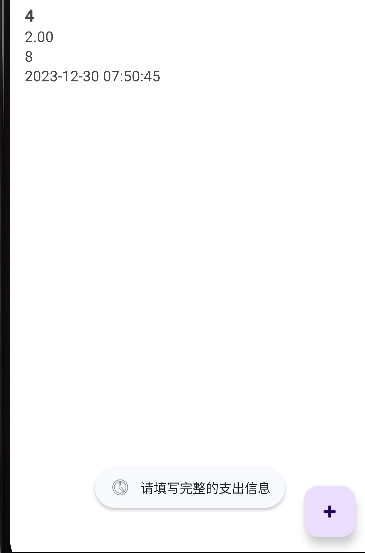
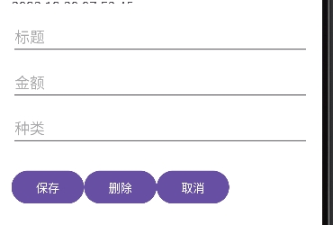

# 一、课题理解与分析：

**所有记分点要求内容均已实现。**

根据要求来看，主界面主要实现的是向各个界面的跳转功能。备忘录界面实现的记录的存储、显示以及其他查看操作。待办事项界面可以通过借鉴备忘录界面实现一些记录的存储、显示以及其他查看操作，但是多了时间和提醒的概念。记账只要结合备忘录界面和待办事项界面即可。

对于数据的存储，可以采用数据库来进行存储以及处理。对于大部分的需求内容，都可以采用课上的讲义内容来执行，例如第二章的界面跳转、第三章的recycleview、fab、menu等、第五章的通知提醒等。
文件链接在文末

# 二、项目结构

├── src 

│ ├── main

│ │ ├── java/com/example/personalassistant 

│ │ │ ├── MainActivity.java //实现界面设计

│ │ │ ├── MemoActivity.java 

│ │ │ ├── TodoActivity.java 

│ │ │ ├── ExpenseActivity.java

│ │ │ ├── SettingsActivity.java

│ │ │ ├── MemoAdapter.java //适配器，实现与recycleview的绑定

│ │ │ ├── TodoAdapter.java 

│ │ │ ├── ExpenseAdapter.java 

│ │ │ ├── Memo.java //实现基本类的设计

│ │ │ ├── Todo.java 

│ │ │ ├── Expense.java 

│ │ │ ├── MemoDatabaseHelper.java //数据库相关，实现数据存储以及处理

│ │ │ ├── TodoDatabaseHelper.java 

│ │ │ ├── ExpenseDatabaseHelper.java 

│ │ │ ├── AlarmReceiver.java //实现接收广播并发送通知

│ │ │ ├── DateTimeUtils.java//实现时间戳与标准时间格式的转化

│ │ │ ├── TimeRange.java //enum类，存取TODAY,MONTH,YEAR三个宏

│ │ ├── res 

│ │ │ ├── layout 

│ │ │ │ │ ├── activity_main.xml //界面布局设计

│ │ │ │ │ ├── activity_memo.xml 

│ │ │ │ │ ├── activity_todo.xml 

│ │ │ │ │ ├── activity_expense.xml 

│ │ │ │ │ ├── activity_settings.xml 

│ │ │ │ │ ├── memo_list_item.xml //recycleview面板上每个item的内容显示设计

│ │ │ │ │ ├── todo_list_item.xml 

│ │ │ │ │ ├── expense_list_item.xml 

│ │ │ │ │ ├── popup_edit_expense.xml //实现添加、修改、删除的popupwindow界面设计

│ │ │ │ │ ├── popup_edit_memo.xml

│ │ │ │ │ ├── popup_edit_todo.xml

│ │ │ │ ├── menu 

│ │ │ │ │ ├── menu_main.xml //menu菜单设计

│ │ │ │ │ ├── menu_memo.xml 

│ │ │ │ │ ├── menu_todo.xml 

│ │ │ │ │ ├── menu_expense.xml 

│ │ │ │ ├── drawable 

│ │ │ │ │ ├── oip.jpg 

│ │ │ │ │ ├── raa.jpg 

│ │ │ │ │ ├── ic_add 

│ │ │ │ │ ├── ic_save 

│ │ │ │ │ ├── ic_notification

│ │ │ │ ├── values 

│ │ │ │ │ ├── strings.xml

│ │ │ │ │ ├── arrays.xml

│ │ │ │ ├── xml

│ │ │ │ │ ├── preferences.xml//设置界面设计

# 三、内容介绍与遇到的问题等

## 1、主屏幕（实现了记分点1的所有内容）

### （1）设计思路

主要设计思路借鉴了第一次实验的实验内容，显示功能列表，实现设置屏幕。

记分点1：显示功能清单，备忘录、待办事项、记账，点击后进入相应的功能页面。应用栏显示设置菜单。进入设置页面后，可以对各功能的分类等信息进行设置。

主界面相关代码内容：

 

设置界面设计内容：

 

### （2）实验结果

实现功能清单的显示以及设置界面屏幕

 

### （3）操作步骤

用户可以可以直接按下对应界面的按钮直接进入该界面，用户可以通过主界面右上角菜单中的设置选项、或者主界面的设置按钮进入设置界面

### （4）遇到的问题

问题：设置界面的显示存在问题。

分析：通过最后一堂课了解到用preferences来进行界面设计。

解决方案：用preference.xml来进行界面设计。

## 2、备忘录（实现了记分点2、3、4所有内容）

### （1）设计思路：

主要设计思路借鉴了最后一次的实验内容，即通过fab向Recycleview控件中添加内容。分类功能默认实现，即进入界面后已经进行了分类，具有相同的标签的记录将相邻排列，并只显示该类第一条记录的标签。

计分点2：显示备忘列表。可按创建时间、标题等对列表排序。

在设计备忘录界面时，我选择使用RecyclerView来展示备忘录列表，并使用Toolbar搭配Menu菜单为用户提供了按创建时间和标题排序的功能。通过在 MemoActivity.java 中实现了排序的方法，用户可以方便地选择不同的排序方式。这样，用户可以根据自己的需求，轻松查看备忘录列表。

 

计分点3：支持添加、删除、修改备忘。

我确保用户能够方便地进行备忘录的添加、删除和修改操作。通过弹出 PopupWindow，用户可以轻松输入或编辑备忘录的标题、内容和标签。保存时，我在 saveOrUpdateMemo 方法中判断备忘录是否为空，从而进行添加或更新的操作，并及时更新备忘录列表。

 

 

计分点4：支持分类和标签。支持按分类或标签筛选备忘。

我在备忘录中新增了标签属性，并提供了按标签筛选备忘录的功能。通过在 MemoDatabaseHelper.java 中提供了获取所有标签和按标签筛选备忘录的方法。在 MemoActivity.java 中实现了显示对话框的方法，并通过选择标签来更新备忘录列表来进行筛选。

备忘录默认实现分类，对于具有相同标签的记录，将会相邻排列，并只显示该类的第一条记录的标签值。

 

 

 

### （2）实现结果：

①按下浮动按钮后，将会弹出一个窗口，用户可以在此弹出窗口输入标题、内容、标签，输入完毕后可以按下保存按钮进行保存，也可以通过按下返回按钮取消添加。

 

②在已有的备忘录记录当中，用户可以点击其中一条记录，来对该记录进行修改或者删除该记录。

 

③用户也可以通过按下筛选按钮，根据标签内容进行筛选，也可以通过按下清除筛选部分来取消筛选

 

④用户可以在menu栏实现跳转设置界面、清空备忘录、排序等操作。

 

⑤退出应用重新打开后，之前的备忘录记录依旧能够保留。

### （3）操作步骤：

用户打开备忘录界面后，可以按通过按下右下角的浮动按钮来添加记录，此时会显示一个popup窗口，你可以在该窗口输入相关信息并进行保存记录，此时删除按钮与返回按钮都表示取消保存记录。

保存记录后该记录会显示在Recycleview当中，点击对应记录，你可以对该记录进行修改/删除/取消修改操作。

按下筛选按钮，你可以根据具体的标签进行筛选。

打开右上角的菜单栏，你可以选择清除记录/设置/按创建日期排序/按标题排序/按标签分类（该分类默认实现）。

最后，用户可以按左上角的箭头返回至主界面。

### （4）遇到的问题：

①问题:日志结果表面数据库表 "memo" 中缺少 "tags" 列但是代码中已经添加了“tags”列。

分析：由于在之前创建数据库时还没有开始做标签功能，导致数据库中缺少“tags”列，之后代码中添加了“tags”列但没有更新数据库，所以出现该问题。

解决方案：由于数据库已经创建，我们需要处理数据库升级的情况。

②问题：点击浮动按钮后，popupwindows只会闪动一下，并不会一直停留在屏幕上直到按下某个按钮。

分析：按照原先代码的逻辑，将只在函数代码执行过后popup窗口就会消失，需要将该窗口的显示与消失定义在某个事件当中。

解决方案：将 PopupWindow 的显示和隐藏放在按钮的点击事件中，并使用全局变量或其他方式来保存 PopupWindow 的实例

③问题：按下Toolbar控件左边的返回箭头没有反应，无法退回至主界面

分析：错误地将跳转至主界面事件放至menu的某个Item中

解决方案：使用 toolbar.setNavigationOnClickListener 为返回箭头按钮设置了点击事件，点击时执行 goToMainActivity() 方法，实现了跳转至主界面的功能。

## 3、待办事项（实现了记分点5，6，7的所有内容）

### （1）设计思路

大部分显示以及布局内容都是模仿备忘录界面实现，对于提醒部分，参考讲义第五章中的内容进行实现

计分点5：显示待办清单。支持按类别、日期筛选。

对于按种类筛选，将获取当前所有的种类内容，用户可以选择对应的种类

对于按日期筛选，根据选择的日期，设置起始时间戳为该日期00：00：00，截止日期为第二天的00：00：00，筛选时间戳在此范围内的记录

 

 

计分点6：添加、删除、修改待办事项。

此处与备忘录的增删改部分相近，但是待办事项界面设计日期与时间，所以增加了TimePicker与datePickerDialog来输入时间与日期

 

 

计分点7：支持提醒功能。提醒分单次和重复两种类型。

此处sendNotification函数包括了讲义中的createNotification函数与handleNotification函数。

由于使用重复提醒的函数为setInexactRepeating函数，所以重复提醒的第一次提醒时间会存在一定的延迟

 

 

### （2）实验结果

①界面整体布局，菜单内容

 

②筛选实现部分

 

（选择12.25筛选后）

③实现增删改部分，popup窗口内容，可以按下选择日期按钮显示日历，可以按下左下角的小键盘将钟表切换成直接输入时间。重复时间通过spinner来选择

 

 

④提醒部分，显然可以上方有通知提醒，下方有toast显示，重复提醒第一次的提醒时间可能要延迟3-5min

 

### （3）操作步骤

用户进入到待办事项界面后，用户可以按下右下角的“+”浮动按钮来添加待办事项记录，用户可以依次1、输入标题、种类、描述，然后可以点击“选择日期”按钮，2、在弹出的日历中选择日期（默认为当天），3、然后用户可以直接在钟表上选择具体时间，或者在左下角的键盘来输入具体的时间。4、然后用户可以选择是否进行重复提醒，并在spinner中选择重复提醒的间隔时间。

同备忘录，用户可以直接点击某条记录来进行修改记录相关内容。

用户可以按下toolbar中的筛选选项来进行标签筛选以及日期筛选，按下标签筛选后，用户可以选择某个标签进行筛选；按下日期筛选后，用户也可以选择某个日期来筛选出记录中年月日与该日期相同的项。两种筛选都可以清除筛选。

用户可以通过右上角的菜单栏来进行清除所有待办事项记录/设置。

用户会在每条记录设置的时间收到通知提醒，但如果是重复提醒，第一次提醒的时间会延迟3-5分钟，但是之后的间隔时间基本准时。

最后，用户可以按左上角的箭头返回至主界面。

### （4）遇到的问题

①问题：有没有什么方式可以使用户对于时间的输入更方便，以替代文字输入

分析：如果存在日历以及钟表式的输入，可能更加直观与方便

解决方案：对于日期选择，可以用DatePickerDialog，对于时间选择，可以用TimePicker控件。

②问题：对于种类筛选能够正常执行，但是对于日期筛选无法执行。

分析：通过日志，沿着操作步骤逐步排查问题，最后发现筛选列表加入的条件为符合种类筛选条件且不符合日期筛选条件

解决方案：考虑到对于每种筛选方式，都要求另一种筛选方式不符合才行，可以对两种筛选方式的判断进行异或，实现只有两者的值不同时才可以进行筛选。（实际代码中对于两种情况直接进行罗列并用||连接）

③问题：再增加提醒功能与重复提醒功能后，运行程序，应用一直闪退

分析：通过日志的报错进行分析，找到错误对应的那一行，最后发现又是数据库生成的表（增加提醒功能前的表）不存在一些列。参考备忘录的方式，通过数据库升级来增加列，但是由于一些粗心错误，将一些变量加入到两个原来就存在的列中间，同时存在部分需要删除的变量，导致不能直接对尾部添加或单纯尾部添加并不能解决问题。

解决方案：理论上可以直接查找表的结构，然后进行DROP部分变量，再增加部分变量即可。最后直接修改数据库名，直接新建了一个数据库的表。

④问题：提醒功能始终无法实现。（实际解决过程中共发现三个问题）

分析：根据日志进行问题排查，发现广播能够正常发送，但是AlarmReceiver始终无法正常接收广播。对于整个代码走了一遍发现是否提醒与是否添加重复提醒变量之间存在混淆。修改后还是无法正常接收提醒，经过相关文档查询，发现setRepeating函数具有一定的延时性，在经过几分钟的等待后，发现广播能够正常被接收（日志显示了接收报告），但是手机屏幕上并没有生成通知弹窗。经过一天的研究，最终发现问题在于虚拟手机上关掉了该软件的通知权限。

解决方案：1、将是否提醒与是否添加重复提醒变量有关的函数进行调整，修改相关函数的参数名称以提高程序可读性。2、对于单次提醒采用setExactAndAllowWhileIdle实现准时提醒，但是重复提醒无法做到准时3、记得打开虚拟手机上的应用通知权限

## 4、记账（实现了记分点8，9的所有内容）

### （1）设计思路

结合备忘录的相关界面设计以及待办事项界面对于日期的相关处理进行设计。

计分点8：显示支出清单。默认显示当天、当月、当年的汇总值。可按日期、月份、年份、类别筛选支出清单，并显示筛选后的汇总值。

Timerange为所选的当天/当月/当年，按下筛选按钮后，系统可以切换至对应的日期，查询该日期当天/当月/当年的相关信息。

 

 

计分点9：添加、删除、修改支出项。

此处基本与备忘录界面的设计相同，多一个存储当前账单记录的记录日期的变量

 

### （2）实验结果

①实现记账主界面的设计，当天/当月/当年的选择

 

②实现筛选进行切换至其他日期

 

③实现增删改的popup界面，如果输入不完整会显示相关toast内容

	

### （3）操作步骤

用户打开备忘录界面后，可以按通过按下右下角的浮动按钮来添加记录，此时会显示一个popup窗口，你可以在该窗口输入相关信息并进行保存记录，此时删除按钮与返回按钮都表示取消保存记录。

用户可以通过选择spinner中的某一项来显示当天/当月/当年的相关账单以及总金额。

用户可以通过按下筛选按钮，来切换至某一天，来查看该日期下当天/当月/当年的相关账单以及总金额。

用户可以通过右上角的菜单栏来进行清除所有记账记录/设置。

最后，用户可以按左上角的箭头返回至主界面。

### （4）遇到的问题

①问题：用户如果在当前日期选择当月的信息的话，再进行筛选至某一天后，虽然显示的是该日的相关信息，但是spinner还是显示“当月”。

分析：timeRangeSpinner.setSelection();函数可以直接设置spinner的状态

解决方案：在updateExpenseListAndTotalAmount函数最后加入timeRangeSpinner.setSelection(0);代码即可。

# 四、心得

该次个人应用的设计是我遇到的工程量最大的开发内容。代码量之大，知识点之多，思维量之大不得不让我沉下心去做。整个项目内容做做停停大概花了小半个月来实现全部要求，是我感慨颇深。一方面使我增加了项目经历，增强了我的码力，对于应用开发有了更多的理解；另一方面也极大地改变了我作为ACM-ICPC算法竞赛校队成员的刁钻码风，为了实现大项目而被迫提高程序可读性。

项目中各界面的难度大概如下：主界面＜设置界面＜＜记账界面＜备忘录界面＜＜待办事项界面。主界面与设置界面主要就是外观，跳转等基础功能的设计。设置界面还好老师最后一堂课提了手能够有所了解。由于我是按照要求顺序所作，导致记账界面被放在了最后。对于做一整个界面首先是要有一个整体的设计与方案选择，由于我做的第一个界面是备忘录界面，这里以备忘录界面作为介绍。一开始，我根据之前所作的实验就决定采用fab按钮搭配recycleview来实现基本框架，在实现输入内容的时候，想起windows应用实践课程中使用的popupwindow，所以选择通过弹窗的形式来实现输入，这样既节省了空间，又可以保留背景避免过于单一。然后再根据最后一次实验实现menu时所使用的toolbar，整个界面框架到此就搭建完备了。

界面设计完毕后，就是对于具体要求的逻辑实践了。由于码力问题，每次写完一部分代码都能保证正确，在我的代码中也可以看到很多通过日志来进行debug的痕迹。但是有时候也会存在一些代码怎么看都对结果就是不能正常实现目标的情况，究其原因都是一些偏门错误，例如缺少依赖、数据库没有升级、应用通知权限关闭等情况。这些问题的出现为我造成了巨大的麻烦，经过相关资料查询，以及一些细节的检查才进行解决。尤其是待办事项的筛选以及提醒部分，两个部分分别消耗我两天时间，前者是因为代码写的太差了导致逻辑较为麻烦，后者主要就是没想到虚拟手机关闭了应用的通知权限。但这些错误也是给了我未来的开发许多经验，例如备忘录的数据库升级问题，我在待办事项遇到时便有了相应的解决方案。虽然过程痛苦，而且应用可能还存在某些bug，但是整个结果下来还是收获颇丰。
